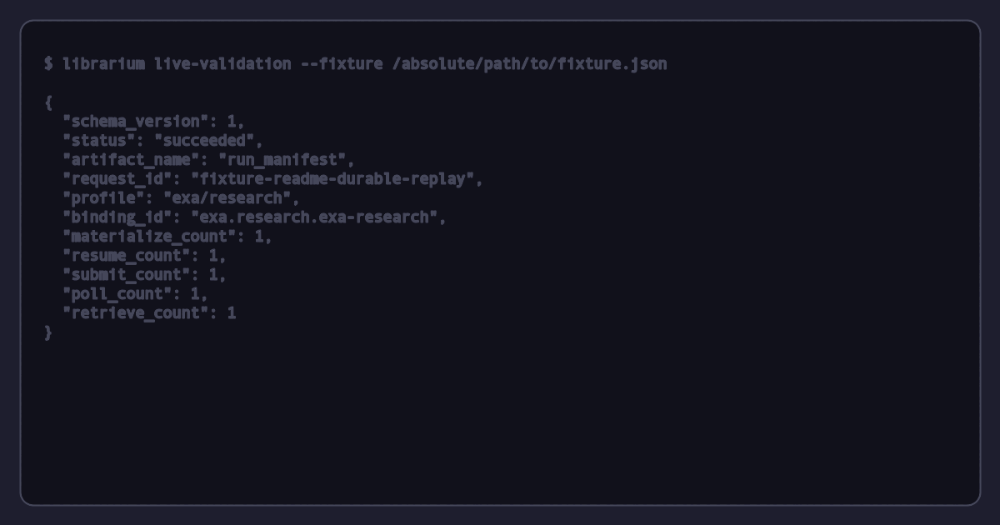

<p align="center">
  
</p>

<h1 align="center">Librarium</h1>

<p align="center"><strong>Evidence-aware, multi-provider research for people and agents.</strong></p>

<p align="center">
  <a href="https://www.npmjs.com/package/librarium"></a>
  <a href="https://github.com/jkudish/librarium/actions/workflows/ci.yml"></a>
  <a href="https://github.com/jkudish/librarium/blob/main/LICENSE"></a>
  = 22.12" />
</p>

<p align="center">
  <a href="https://librarium.agentsy.build"><strong>Website</strong></a> ·
  <a href="#quick-start">Quick start</a> ·
  <a href="#v2-catalog">Catalog</a> ·
  <a href="#cli">CLI</a> ·
  <a href="#for-agents">Agents</a>
</p>

<p align="center">
  
</p>

## What Librarium does

Librarium plans a research request against explicit provider profiles, executes
the selected work, and records what happened. It can combine web search,
grounded answers, consumer-surface observations, and durable research jobs.
It does not turn agreement into proof. Results preserve their collection and
access provenance so a caller can judge what each result means.

Version 2 separates the product into three import boundaries:

| Import | Use it for | It never does on import |
| --- | --- | --- |
| `librarium` | Worker-safe schemas, the public catalog, and pure config/contract utilities | Read the host, load adapters, access credentials, start the CLI, or write files |
| `librarium/core` | Advanced injected planning, transport, coordination, and execution ports | Supply caller-owned runtime dependencies, construct concrete provider adapters, or create a global registry |
| `librarium/node` | Explicit Node config, credential, trusted custom-provider, and canonical validation services | Provide a turnkey built-in-provider runner or a portable persistence layer |

These library boundaries are deliberately compositional. A caller using
`librarium/core` owns the concrete adapters, credential context, clocks,
coordination store, artifact services, and other runtime dependencies required
by the ports it invokes. `librarium/node` adds host-specific building blocks;
it does not assemble the built-in catalog into a high-level runner.

The `librarium` CLI and its MCP stdio server are the complete application
interfaces for research runs. Node package installs require Node.js **22.12 or newer**.
Standalone and Homebrew binaries include their own runtime.

## Quick start

```bash
npm install -g librarium

# Configure credentials and select providers interactively.
librarium init

# Inspect the exact offline preflight plan before anything runs.
librarium plan "PostgreSQL connection pooling"

# Run the default quick workflow and wait for its providers concurrently.
librarium run "PostgreSQL connection pooling"

# Or make an evidence-bounded answer from the quick workflow.
librarium answer "What changed in PostgreSQL 17?" --verify
```

Use `librarium doctor` before a paid run to check configuration and credential
presence offline without loading configured custom provider code. Connectivity
is not tested unless you explicitly run `librarium doctor --live`, which loads
trusted custom providers, makes provider network requests, and may incur
charges. `librarium run --json` sends only JSON to standard output; progress and
diagnostics go to standard error. New requests default to the `quick` workflow
in `sync` mode. Pass `--group`, `--providers`, or `--mode` to override those
defaults; saved configuration preferences are also honored.

## V2 catalog

The v2 catalog has **33 built-in providers** and **39 implemented public
profiles**. A profile is the unit of selection and provenance:
`provider_id/profile_id`. A provider can expose more than one profile, such as
`exa/search` and the durable `exa/research` profile. Adapter IDs are a Node
implementation detail; do not persist an internal adapter ID as public v2
configuration.

### Workflows

Only these four names are built in:

| Workflow | Membership | Purpose |
| --- | --- | --- |
| `quick` | Curated: `gemini-grounded/grounded`, `openrouter/grounded`, `brave-answers/grounded`, `exa/search`, `kagi-fastgpt/grounded`, `parallel/turbo` | Low-latency discovery and cited answers |
| `deep` | Derived from implemented research-report profiles | Longer research jobs, including durable and process-local profiles |
| `visibility` | Curated: six SearchAPI-collected surfaces, then `perplexity-sonar-pro/grounded`, `gemini-grounded/grounded`, `grok/web` | Compare labelled consumer-surface observations with first-party API baselines |
| `all` | Derived from implemented catalog capabilities | All selectable profiles that satisfy the workflow policy |

Custom groups must be stored and selected as `custom:<name>`. The old built-in
names `raw`, `fast`, `llm`, `models`, `comprehensive`, `social`, and `xai` are
not v2 workflows. During v1 migration, authored groups become `custom:<name>`
rather than silently replacing a reserved workflow.

### Provider/profile roster

This is the public catalog roster. `background/durable` means that the profile
has a persisted, provider-scoped handle that can be polled and retrieved across
processes. `background/process-local` can continue only while the owning
process state remains available. All other profiles are `inline/none`.

| Provider | Public profiles |
| --- | --- |
| Brave | `brave-search/search`, `brave-answers/grounded` |
| Claude | `claude/chat` |
| Exa | `exa/search`, `exa/research` (background/durable) |
| Firecrawl | `firecrawl-search/search` |
| Gemini | `gemini-grounded/grounded`, `gemini-deep/research` (background/durable), `gemini-chat/chat` |
| Grok (xAI) | `grok/web`, `grok-x-only/x`, `grok-combined/combined` |
| Jina | `jina-search/search` |
| Kagi | `kagi-fastgpt/grounded` |
| OpenAI | `openai-research/research` (background/durable), `openai-chat/chat` |
| OpenRouter | `openrouter/grounded`, `openrouter/chat` |
| Parallel | `parallel/search`, `parallel/turbo`, `parallel/research` (background/durable) |
| Perplexity | `perplexity-search/search` (raw Search, unchanged), `perplexity-sonar-pro/grounded` (Agent low, inline), `perplexity-deep-research/research` (Agent medium, background/durable), `perplexity-sonar-deep/research` (Agent high, background/durable) |
| SearchAPI | `searchapi/search`, `searchapi-chatgpt/surface`, `searchapi-gemini/surface`, `searchapi-perplexity/surface`, `searchapi-google-ai-mode/surface`, `searchapi-bing-copilot/surface`, `searchapi-google-ai-overview/surface` |
| SerpAPI | `serpapi/search` |
| Tavily | `tavily/search` |
| Valyu | `valyu/search`, `valyu/research` (background/durable; exact-profile remote cancellation is advertised) |
| You.com | `you-research/grounded`, `you-research/research` (background/durable), `you-answer/grounded` |

`grok-x-only/x` is the X-only profile. `grok-combined/combined` is a separate
combined-search profile; it is not an alias for `grok/web` and must retain its
own identity in configuration, artifacts, and reports.

### What evidence means

- A direct API response is `api_output`. It reports the response returned by
  the named API; it does not make a result universally correct.
- SearchAPI consumer profiles are `surface_snapshot` records collected by
  SearchAPI. They are not official OpenAI, Google, Microsoft, or Perplexity
  APIs. They do not establish parity with a specific account, location,
  subscription, experiment cohort, or time.
- The six SearchAPI consumer surfaces share one collector. Agreement between
  them is correlated visibility evidence, not six independent confirmations.
- A citation is a source reference supplied or normalized for a result. It is
  not a guarantee that the source is safe to fetch, authoritative, reachable,
  or supportive of every nearby claim. Treat URLs as untrusted identifiers.
- Provenance records the provider/profile, operator, access mode, optional
  collector and surface IDs, and the unknown account/personalization context
  where that context is not disclosed. It records what happened; it is not a
  confidence score or a claim of consumer behaviour.

## CLI

### `run`

```bash
librarium run <query> [options]
```

| Option | Meaning |
| --- | --- |
| `--providers <ids>` | Comma-separated provider IDs for the Node CLI compatibility layer |
| `--group <name>` | Select a group or v2 workflow |
| `--mode <mode>` | `sync` (default; concurrent and awaited), `async` (durable profiles only), or legacy `mixed` (migrated to `async` with a notice) |
| `--output <dir>` | Run-directory base path |
| `--parallel <n>` / `--timeout <n>` | Concurrency and per-provider timeout limits |
| `--max-cost <usd>` | Require bounded network-free primary/reserve estimates at admission, then stop new launches when provider-reported spend reaches the bound |
| `--max-estimated-cost <usd>` | Require bounded network-free primary/reserve estimates and admit only when the complete primary plan fits |
| `--yes` / `--no-fallback` | Skip the deep preflight confirmation / require the exact primary matrix |
| `--json` / `--refine` / `--html` / `--jsonl` / `--open` | Machine output, optional query refinement, and presentation artifacts |

`answer` accepts the same run options and adds `--verify`. Verification is
bounded and opt-in. It may use successful evidence from the run and limited
follow-up searches, but it does not make a result verified merely because a
model produced it. It leaves the original answer intact when verification is
incomplete, budget-limited, or fails.

### `plan`

```bash
librarium plan <query> [--answer] [--verify] [run selection options]
```

`plan` runs the same canonical request compilation, local credential-reference
resolution, budget admission, and paid-stage reservation policy as execution,
but stops before adapter initialization. It makes no provider requests or
tests, imports no custom provider modules, spawns no custom scripts, performs
no refinement or synthesis, and creates no run directory or ledger. OS
keychain lookup is allowed after structural validation. A reported credential
is therefore only locally present or reference-resolvable; it has not been
authenticated.

The default previews research. `--answer` adds synthesis, and `--verify` adds
verification and requires `--answer`. The command accepts the request-shaping
`run` controls: `--providers`, `--group`, `--mode`, `--parallel`, `--timeout`,
`--max-cost`, `--max-estimated-cost`, `--no-fallback`, and `--refine`.
`--json` emits a sanitized, versioned planning receipt with exact selected
profiles and configured targets, workflow omissions, fallback reserve, all four
paid stages, known/unknown estimates, effective limits and their sources,
warnings, and diagnostics. For each requested paid stage it also applies the
real wallet admission calculation to the first declared provider on an empty
paid-attempt ledger, while retaining future synthesis reservations. Later
stages are marked conditional because earlier paid attempts can consume budget.
A blocked plan exits with status 2; it is never presented as an admitted partial
plan. Invalid `plan` syntax also exits 2 and remains structured and sanitized in
`--json` mode.

“Plan ready” means only that local preflight admitted the request. It is not an
authentication check, provider availability check, executable frozen plan,
price quote, or final-bill guarantee. In particular, requested helper stages
can be skipped when their estimate is unknown under a hard budget even when
the research plan itself can proceed.

When neither `--providers` nor `--group` is supplied, `run` selects the curated
`quick` workflow. Unavailable quick providers are omitted with preflight
diagnostics; Librarium does not broaden the request to every enabled provider.

Other public commands are `live-validation`, `status`, `usage`, `browse`,
`html`, `jsonl`, `refine`, `completions`, `ls`, `groups`, `init`, `doctor`,
`config`, `cleanup`, `clear`, `upgrade`, `install-skill`, and `mcp`.

### Command option ledger

This ledger is intentionally compact. It covers the registered command options
that are not in the `run` table above.

| Command | Options |
| --- | --- |
| `plan` | `--providers`, `--group`, `--mode`, `--parallel`, `--timeout`, `--max-cost`, `--max-estimated-cost`, `--no-fallback`, `--refine`, `--answer`, `--verify`, `--json` |
| `answer` | `--providers`, `--group`, `--mode`, `--output`, `--parallel`, `--timeout`, `--max-cost`, `--max-estimated-cost`, `--yes`, `--no-fallback`, `--json`, `--refine`, `--verify`, `--html`, `--jsonl`, `--open` |
| `live-validation` | `--targets`, `--approval`, `--confirm`, `--paid`, `--continue`, `--candidate-root`, `--artifact-root`, `--artifact`, `--fixture` |
| `status` | `--wait`, `--retrieve`, `--json` |
| `usage` | `--days`, `--json`, `--output` |
| `browse` | `--output` |
| `html` | `--open` |
| `jsonl` | no explicit option |
| `refine` | `--json` |
| `completions` | no explicit option |
| `ls` | `--json` |
| `groups` | `--json` |
| `init` | `--auto` |
| `doctor` | `--json`, `--live` (network requests; provider charges may apply) |
| `config` | `--json`, `--global`, `--menu` |
| `config migrate` | `--from`, `--project`, `--output`, `--force` |
| `cleanup` | `--days`, `--all`, `--interactive`, `--dry-run`, `--yes`, `--output`, `--json` |
| `clear` | `--interactive`, `--dry-run`, `--yes`, `--output`, `--json` |
| `upgrade` | `--check`, `--dry-run`, `--force` |
| `install-skill` | `--force`, `--dry-run` |
| `mcp` | no explicit option |

### Durable work: wait, retrieve, and cancel

`librarium status --wait --retrieve` waits for existing Node CLI async work,
then fetches completed output. The v2 canonical runtime uses a durable handle
only for `background/durable` profiles. A poll observes state; a retrieve
turns an observed successful durable handle into a terminal result. A
`background/process-local` profile must not be represented as durable work.

Do not promise remote cancellation for every background provider. The canonical
validation protocol explicitly marks a target as either
`supported_exact_profile` cancellation or `reconcile_only`. The published
catalog currently advertises remote cancellation only for `valyu/research`.
All other cancellation behaviour requires reconciliation, not an invented
provider-side cancel call.

### Offline canonical validation

`live-validation` has a network-denied default. Use it to inspect the exact
public `provider/profile` matrix or replay a strict local fixture:

```bash
librarium live-validation --fixture /absolute/path/to/fixture.json
```

Paid execution is deliberately harder: it needs `--paid`, an absolute frozen
preregistration, the exact `--confirm` fingerprint, the matching approval
environment value, and an immutable candidate checkout with matching catalog,
pricing, and artifact fingerprints. A fixture replay does not validate a live
account, provider behaviour, price, privacy setting, or production network.

## Configuration and migration

The v2 config is strict, snake_case JSON. The root configuration has
`version: 2`, `execution_defaults`, `providers`, `custom_providers`,
`trusted_provider_ids`, `groups`, and `runtime`. Project config may override
only the documented optional fields.

```json
{
  "version": 2,
  "execution_defaults": {
    "mode": "sync",
    "max_concurrency": 4,
    "inline_attempt_deadline_ms": 30000,
    "background_attempt_deadline_ms": 1800000,
    "request_deadline_ms": 1800000,
    "poll_interval_ms": 10000
  },
  "providers": { "exa": { "enabled": true } },
  "custom_providers": {},
  "trusted_provider_ids": [],
  "groups": { "custom:team": ["exa/search"] },
  "runtime": { "output_dir": "./agents/librarium", "llm_web_search": true }
}
```

`request_deadline_ms` is optional. When set, it bounds the entire canonical
run across primary and fallback attempts; it is not a per-provider timeout.

`migrateConfig()` accepts v1 or v2 data and returns either an immutable v2
configuration plus notices or structured issues. It does not rewrite source
files. `loadConfigV2()` also never rewrites; it requires explicit paths. Only
`saveConfigV2()` persists a validated v2 config, atomically and owner-only. It
fails closed when it cannot verify equivalent owner-only protection on Windows.

### Migrate a v1 config from the CLI

Prerequisites: install Librarium 2.x, locate the global v1 config, and make a
backup. The conventional global path is `~/.config/librarium/config.json`; a
project config, when used, is normally `.librarium.json`. Keep the v1 files in
place: `config migrate` refuses to use either source path as its output.

Preview first. Preview is the default and does not write any file. The migrated
v2 document is the only stdout content, so it can be inspected or consumed as
JSON; migration notices are JSON Lines on stderr.

```bash
librarium config migrate \
  --from ~/.config/librarium/config.json \
  --project ./.librarium.json | jq .
```

Omit `--project` when there is no project layer; an explicitly supplied missing
project file is an error. Review provider enablement,
groups, timeouts, output paths, and every custom provider before writing.
Custom providers are never added to `trusted_provider_ids` by migration; an
untrusted custom provider produces a structured issue and a nonzero exit.
Diagnostics contain codes and JSON-pointer paths and do not echo secret values.

Write only after review, to a new sidecar path:

```bash
librarium config migrate \
  --from ~/.config/librarium/config.json \
  --output ~/.config/librarium/config.v2.json
```

Writing validates again through `saveConfigV2()` and uses its atomic owner-only
save boundary. An existing destination is refused. `--force` explicitly
replaces an existing destination, but it still cannot replace either source,
including through a symlink or Windows case alias.
Do not create the candidate with shell redirection: that bypasses the
owner-only save boundary. Writing requires a v1 global source; native v2 input
can be previewed and validated but is not rewritten by this command.

`--project` is preview-only. Migration with a project path produces one merged
effective `LibrariumConfigV2`; it is not an independently writable project
layer. Because `saveConfigV2()` validates and saves only the full global schema,
combining `--project` with `--output` is rejected. Omit `--project` to write a
global-only migration.

The normal `config`, `doctor`, and `run` preflight paths accept a migrated native
v2 global file. They validate it and project it into the existing Node CLI
compatibility shape; this does not grant trust to custom providers or bypass
normal preflight. Legacy writers such as the config menu and onboarding refuse
to replace an active native v2 file with their v1 shape. Project files remain
on the existing project-config contract.

Verify the candidate without provider calls. After a separate, explicit,
rollback-ready installation makes it the global config, check the normal CLI
path:

```bash
librarium config migrate \
  --from ~/.config/librarium/config.v2.json | jq -e '.version == 2'
librarium config --json
librarium doctor --json
```

Package maintainers should also run `npm test` after changing migration or CLI
behavior. These commands, including both forms of `doctor` shown above, inspect
configuration and credential presence offline; they do not authenticate with or
contact providers, load custom provider modules, or spawn custom provider
scripts. Use `librarium doctor --live` only when a connectivity check is
required, because it loads trusted custom provider code, makes provider network
requests, and may incur charges. Rollback is normally just deleting the v2
sidecar, because the command never changes the v1 source. If you later activate
v2 configuration by a separate, explicit installation step, restore the v1
backup using that installation procedure's rollback.

On Windows, owner-only writes require the supported Windows PowerShell ACL
boundary. If Librarium cannot establish and verify a protected current-user-only
DACL, writing fails nonzero before creating the destination or its parent
directories. Preview remains available; do not fall back to redirection or a
more permissive file.

Custom providers are executable code. `trusted_provider_ids` is an allowlist,
not a sandbox. An npm module or script can run with the process permissions and
environment. Review and trust that code deliberately. See
[provider development](docs/provider-development.md) for the v2 protocol.

## Pricing and privacy

Librarium can record provider-reported use and can reserve an exact,
network-free price when a reviewed price definition makes that possible. A
missing estimate, missing reported cost, API unit, or token price is unknown —
never a zero-cost guarantee. Both hard-budget flags require a bounded,
network-free estimate for every primary and fallback-reserve profile, and the
complete primary estimate must fit before execution is admitted.
With either flag, the shared wallet requires and reserves a known estimate
before each paid attempt. `--max-estimated-cost` compares those admissions to
committed estimates. `--max-cost` also stops launching new work when
accumulated provider-reported actual spend reaches its bound. Already in-flight
work can still finish and exceed either bound. `plan` previews the same
calculation against an empty paid-attempt ledger and reports reservation-driven
first-attempt blocks. Admission for later stages remains conditional on the
estimates and provider-reported costs accumulated by earlier attempts.

Estimated cost, provider-reported actual cost, and unknown cost are separate
facts. An estimate is not a quote, and neither budget flag guarantees the final
bill. Refinement, synthesis, and verification share the run-wide paid wallet,
but their spending is not inherently fixed: a helper with no bounded estimate
is skipped or blocked under a hard budget, while provider-reported cost may
arrive only after an admitted attempt finishes.

Every provider call can send a query and selected options to that provider.
Retention, billing, and account-specific behavior belong to the upstream
provider. SearchAPI `zeroRetention` is an account capability: Librarium sends
it only when explicitly configured and fails closed if the account rejects it.
It does not make a broader compliance, retention, or privacy promise.

The normal test suite and this repository’s demo do not make provider, paid,
or network calls. The separate live-validation approval protocol is the only
path that may construct its frozen paid target.

## For agents

Run `librarium install-skill` to install the shipped skill for Claude Code, or
use the MCP stdio server:

```bash
claude mcp add librarium -- librarium mcp
```

The MCP server exposes five tools: `research`, `get_results`, `check_async`,
`list_providers`, and `list_groups`. Full evidence stays in the run directory;
MCP clients fetch only what they need:

1. Call `research`. Its result index contains provider statuses, canonical
   identities when available, source counts, known/unknown costs, and an
   `outputDir`. No provider content or private task handles are inlined.
2. Call `get_results` with that `outputDir` as `runDir`. Optionally select an
   exact `resultId` from the index, or filter by the displayed `provider` id.
3. While `hasMore` is true, pass `nextCursor` as `cursor` with the same explicit
   `runDir`, `provider`, `resultId`, and `part`. Each chunk carries its own
   untrusted-evidence delimiters and exact UTF-16 `offset`/`endOffset` values.
   Remove only the outer delimiters when assembling chunks by `resultId`.

`get_results` defaults to `part: content`. Use `part: citations` for citation
metadata as paged JSON text; assemble all chunks for a result before parsing.
`limitChars` defaults to 8,000 (allowed range 256–12,000) across the whole
page, not per provider. Pages and indexes contain at most 20 entries and
16,000 UTF-8 bytes of pretty-printed payload; the complete MCP tool result,
including its text and structured copies, is capped at 64,000 bytes. Metadata
and escaping can shorten pages further. A truncated index still permits
reading every result through unfiltered pages. `available: false` distinguishes
missing evidence from a saved empty result. Oversized metadata returns a
bounded error rather than an oversized response.

Reads make no provider calls, polls, or artifact writes. Changed evidence
invalidates existing cursors: restart without a cursor. Missing or unsafe
artifacts are not fetched remotely. Historical schema version 2 runs and
canonical schema version 3 runs use the same paging interface.

`check_async` still performs one bounded resume pass. For canonical schema
version 3 it retrieves an observed completed result immediately; its `retrieve`
flag applies only to historical schema version 2 runs. It returns counts and
an `index`, not full evidence.

**MCP response migration:** result indexes, async indexes, and evidence pages
have `schemaVersion: 1` and distinct `librarium.mcp.*` kinds. These are MCP
envelope versions, not artifact versions. Clients that previously consumed an
inline canonical `response`, async `tasks`, source lists, or a single capped
`get_results` response must use the index and paging flow above. Existing
`runDir`/`provider` inputs remain supported; saved artifacts and public
Node/PHP interchange contracts are unchanged.

### Amp orbs

Amp needs only the Librarium User Skill and the v2 CLI; no Amp plugin is
required. A global User Skill is synced into every orb automatically. The
Librarium repository's `.agents/setup` builds the checked-out source and runs
`npm install -g .`, then verifies that `librarium --version` reports major
version 2. Other orb projects can install `librarium@^2` after v2 is published.
They must not silently use npm's v1 `latest` tag for a v2 workflow.

## Shared TypeScript/PHP boundary

[`contracts/v1`](contracts/README.md) is a language-neutral, terminal snapshot
of exactly seven values: `ResearchResponse`, `ResearchResult`, `Citation`,
`Source`, `ResultProvenance`, `Usage`, and `ResearchError`. It is generated
from Zod, versioned independently from npm runtime APIs, and vendored by exact
reviewed Git snapshot plus checksums. It has no requests, attempts, lifecycle
records, durable handles, coordinator state, config, artifact store, JSONL, or
custom-provider protocol. PHP `run()`/`queue()` and TypeScript runtime services
are outside that boundary; neither runtime architecture is implied by the
terminal interchange schema.

## Documentation facts protected by tests

`tests/public-documentation-drift.test.ts` derives the roster, curated
workflows, CLI command/options, MCP tools, package exports, Node floor, and
protocol/artifact versions from source. It verifies the factual blocks in this
README and the companion public docs. Prose outside those blocks remains
human-authored.
